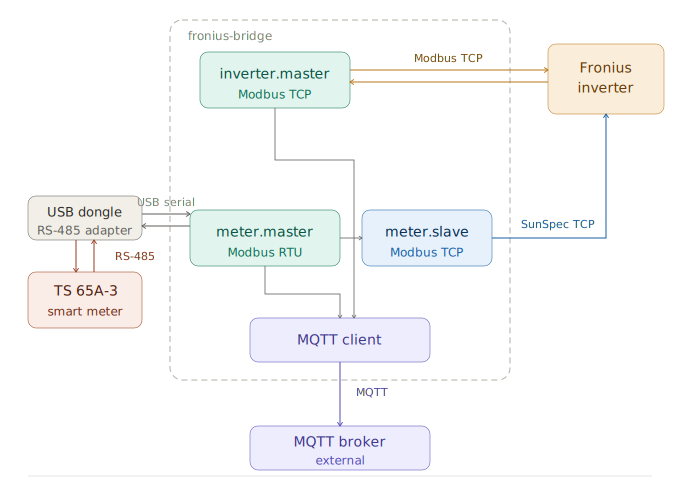

[](https://github.com/ahpohl/fronius-bridge/actions/workflows/build.yml)

# fronius-bridge

fronius-bridge is a lightweight service that reads operational data from Fronius inverters and smart meters and publishes it to MQTT as JSON. It supports both Modbus TCP (IPv4/IPv6) and Modbus RTU (serial) connections.

## Features

- Reads inverter values such as power and energy
- Reads smart meter values (Fronius TS65-a and SunSpec-compatible meters)
- Supports Modbus over TCP (IPv4/IPv6) and serial RTU
- Manages night-time disconnections when the inverter enters standby and resumes publishing automatically
- Publishes values, events, device info and connection availability as JSON to an MQTT broker
- Fully configurable through a YAML configuration file
- Extensive, module-scoped logging
- Automatic detection of register model, number of phases, MPPT tracker inputs, and hybrid/storage capability

## Common topology

The diagram below shows the recommended setup. `inverter.master` reads the Fronius inverter over Modbus TCP. `meter.master` reads the Fronius TS65-a smart meter directly over Modbus RTU via a USB RS-485 adapter using the proprietary register map. `meter.slave` re-serves the meter values back to the inverter as a SunSpec-compliant Modbus TCP server so the inverter can use the meter for feed-in management. Both masters publish to an external MQTT broker.



The `inverter` and `meter` sections are both optional — at least one must be configured. Other supported configurations are described under [Supported topologies](#supported-topologies).

## Status and limitations

- Battery/storage data is detected but not yet supported.
- A PostgreSQL consumer is planned but not implemented yet.
- TLS in libmosquitto not yet supported.

## Dependencies

- [libfronius](https://github.com/ahpohl/libfronius) — Modbus communication with inverter and meter
- [libmosquitto](https://mosquitto.org/) — MQTT client library
- [yaml-cpp](https://github.com/jbeder/yaml-cpp) — YAML configuration parsing
- [spdlog](https://github.com/gabime/spdlog) — Structured logging

## Configuration

fronius-bridge is configured via a YAML file passed with `-c <path>` (or the `FRONIUS_CONFIG` environment variable). The `inverter` and `meter` sections are both optional, but at least one must be present.

### Example config

```yaml
inverter:
  tcp:
    host: primo.home.arpa
    port: 502
  unit_id: 1
  response_timeout:
    sec: 5
    usec: 0
  update_interval: 4
  reconnect_delay:
    min: 5
    max: 320
    exponential: true

meter:
  master:
    rtu:
      device: /dev/ttyUSB0
      baud: 9600
      data_bits: 8
      stop_bits: 1
      parity: none
    unit_id: 1
    response_timeout:
      sec: 5
      usec: 0
    update_interval: 4
    reconnect_delay:
      min: 5
      max: 320
      exponential: true
  slave:
    tcp:
      listen: 0.0.0.0
      port: 502
    unit_id: 1
    use_float_model: false

mqtt:
  broker: localhost
  port: 1883
  topic: fronius-bridge
  #user: mqtt
  #password: "your-secret-password"
  queue_size: 100
  reconnect_delay:
    min: 2
    max: 64
    exponential: true

logger:
  level: info
  modules:
    main: info
    inverter: info
    mqtt: info
    meter:
      master: info
      slave: info
```

### Configuration reference

**Transport fields** (shared by `inverter`, `meter.master`, and `meter.slave`):

- tcp / rtu: Configure exactly one transport per section.
  - tcp.host *(master only)*: Hostname or IP (IPv4/IPv6) of the remote device.
  - tcp.listen *(slave only)*: Bind address for the listener. Use `0.0.0.0` for all IPv4 interfaces (default).
  - tcp.port: Modbus TCP port (default: 502). For slave mode this is the local listening port.
  - rtu.device: Serial device path (e.g. `/dev/ttyUSB0`).
  - rtu.baud: Baud rate (e.g. 9600, 19200, 38400).
  - rtu.data_bits / rtu.stop_bits: Data bits (5–8) and stop bits (1–2).
  - rtu.parity: `none`, `even`, or `odd`.
- unit_id: Modbus unit/slave ID of the remote device (typically 1).
- response_timeout.sec / .usec: Response timeout — total = sec + usec. Increase on slow links.
- update_interval: Polling interval in seconds.
- reconnect_delay.min / .max / .exponential: Reconnect backoff. `exponential: true` ramps from min to max; `false` uses a fixed delay equal to min.

**inverter** *(optional)*: Connects to the Fronius inverter. Fields are the transport fields above.

**meter** *(optional)*:
- master: Reads meter register data. Required when `meter` is configured. Two register models are auto-detected on connect — no manual selection needed:
  - *Fronius TS65-a proprietary* — direct RTU connection to a TS65-a smart meter.
  - *SunSpec* — all other cases: meter proxied via the inverter's TCP interface (use `unit_id: 240` for the primary meter, 241 for secondary), or any standalone SunSpec-compatible meter.
- slave *(optional)*: Exposes a SunSpec-compliant Modbus server so the inverter or another master can read meter values from fronius-bridge. Either TCP or RTU may be used; for the standard Fronius use case, configure TCP. Requires `meter.master` to be configured. `meter.master` and `meter.slave` may not share the same RTU device.
  - request_timeout: Seconds to wait for a request before considering the session stalled.
  - idle_timeout: Seconds of inactivity after which the client is treated as gone. In TCP mode the idle client is disconnected; in RTU mode the listener keeps running and simply marks the client inactive in the log.
  - use_float_model: `false` (default) exposes int+sf registers (Fronius-compatible); `true` exposes 32-bit IEEE 754 float registers.

**mqtt**: Connection to the MQTT broker.
- broker / port: Broker hostname and port (1883 unencrypted, 8883 TLS).
- topic: Base topic — subtopics (`/inverter/values`, `/meter/values`, etc.) are appended automatically.
- user / password: Optional broker authentication.
- queue_size: Per-topic publish queue depth. Messages beyond this limit are dropped.
- reconnect_delay: Same semantics as inverter.reconnect_delay.

**logger**:
- level: Global default — `off`, `error`, `warn`, `info`, `debug`, `trace`.
- modules: Per-module overrides using the same level values. Module keys: `main`, `inverter`, `mqtt`, `meter.master`, `meter.slave`. Use `debug` or `trace` when diagnosing connectivity issues; `trace` produces verbose frame dumps.

## Supported topologies

**Inverter only** — omit the `meter` section. Reach the inverter over TCP or RTU.

**Meter only** — omit the `inverter` section. Useful for standalone meter monitoring.

**Meter behind inverter (TCP proxy)** — configure `meter.master` with TCP pointing at the inverter's IP and `unit_id: 240` (primary meter per the Fronius Datamanager specification; secondary starts at 241). The inverter proxies register requests to the meter on its internal RS-485 port over SunSpec. No USB dongle required, and `meter.slave` is unnecessary since the inverter already has direct meter access.

**Meter slave without inverter** — `meter.slave` can operate without `inverter` configured. fronius-bridge reads the meter via `meter.master` and serves the values over TCP (or RTU) to any Modbus master that connects.

**Shared RTU bus** — `inverter.master` and `meter.master` may share the same physical serial dongle by setting both `inverter.rtu.device` and `meter.master.rtu.device` to the same path (e.g. `/dev/ttyUSB0`). fronius-bridge serializes all wire access on a shared device through a single transaction queue, so the inverter and meter are polled in turn rather than concurrently. When sharing, all RTU line parameters (`baud`, `data_bits`, `stop_bits`, `parity`) must match across the two sections; configurations with conflicting parameters are rejected at startup. The two devices must use different `unit_id` values.

## MQTT publishing

Messages are published as JSON under the configured base topic. QoS 1, retained. Consecutive duplicate payloads per topic are suppressed.

| Component | Subtopic                        | Content                         |
|-----------|---------------------------------|---------------------------------|
| Inverter  | `<topic>/inverter/values`       | Telemetry (power, energy, etc.) |
| Inverter  | `<topic>/inverter/events`       | Faults and alarms               |
| Inverter  | `<topic>/inverter/device`       | Static device metadata          |
| Inverter  | `<topic>/inverter/availability` | `connected` or `disconnected`   |
| Meter     | `<topic>/meter/values`          | Telemetry (power, energy, etc.) |
| Meter     | `<topic>/meter/device`          | Static device metadata          |
| Meter     | `<topic>/meter/availability`    | `connected` or `disconnected`   |

### Example payloads

- Topic: `<topic>/inverter/values`
  ```jsonc
  {
    "time": 1762607887640,
    "ac_energy": 11060.2,
    "ac_power_active": 238.0,
    "ac_power_apparent": 238.1,
    "ac_power_reactive": 5.0,
    "ac_power_factor": -100.0,
    "phases": [{ "id": 1, "ac_voltage": 235.9, "ac_current": 1.0 }],
    "ac_frequency": 50.0,
    "dc_power": 285.2,
    "efficiency": 83.4,
    "inputs": [
      { "id": 1, "dc_voltage": 294.2, "dc_current": 0.45, "dc_power": 132.4, "dc_energy": 5468.4 },
      { "id": 2, "dc_voltage": 293.9, "dc_current": 0.52, "dc_power": 152.8, "dc_energy": 0.1 }
    ]
  }
  ```

- Topic: `<topic>/inverter/events`
  ```json
  { "active_code": 0, "state": "Tracking power point", "events": [] }
  ```

- Topic: `<topic>/inverter/device`
  ```jsonc
  {
    "manufacturer": "Fronius", "model": "Primo 4.0-1", "serial_number": "34119102",
    "firmware_version": "0.3.30.2", "data_manager": "3.32.1-2",
    "register_model": "int+sf", "hybrid": false,
    "inverter_id": 101, "slave_id": 1, "phases": 1, "mppt_tracker": 2, "power_rating": 4000.0
  }
  ```

- Topic: `<topic>/meter/values`
  ```jsonc
  {
    "time": 1762607887640,
    "energy_active_import": 3521.847,   "energy_active_export": 8042.113,
    "energy_apparent_import": 3980.201, "energy_apparent_export": 8510.774,
    "energy_reactive_import": 120.034,  "energy_reactive_export": 410.882,
    "power_active": -1842.0, "power_apparent": 1843.0, "power_reactive": 45.0,
    "power_factor": -99.9, "frequency": 50.0,
    "voltage_ph": 234.2, "voltage_pp": 0.0, "current": 7.864,
    "phases": [
      {
        "id": 1, "power_active": -1842.0, "power_apparent": 1843.0,
        "power_reactive": 45.0, "power_factor": -99.9,
        "voltage_ph": 234.2, "voltage_pp": 0.0, "current": 7.864
      }
    ]
  }
  ```

- Topic: `<topic>/meter/device`
  ```jsonc
  {
    "manufacturer": "Fronius", "model": "TS65-a-3", "serial_number": "12345678",
    "firmware_version": "1.3.0", "data_manager": "",
    "register_model": "proprietary", "slave_id": 1, "meter_id": 203, "phases": 1
  }
  ```

### Inverter field reference

| Field               | Description                      | Units | Notes |
|---------------------|----------------------------------|-------|-------|
| time                | Timestamp (Unix epoch)           | ms    | UTC |
| ac_energy           | Cumulative AC energy             | Wh    | |
| ac_power_active     | Active AC power                  | W     | |
| ac_power_apparent   | Apparent AC power                | VA    | |
| ac_power_reactive   | Reactive AC power                | var   | |
| ac_power_factor     | Power factor                     | %     | Range -100..100 |
| ac_frequency        | AC frequency                     | Hz    | |
| phases[].id         | Phase index                      | —     | Starts at 1 |
| phases[].ac_voltage | Per-phase AC voltage             | V     | |
| phases[].ac_current | Per-phase AC current             | A     | |
| dc_power            | Total DC input power             | W     | Sum of inputs |
| efficiency          | Conversion efficiency            | %     | ac_power_active / dc_power × 100 |
| inputs[].id         | DC input index                   | —     | Starts at 1 |
| inputs[].dc_voltage | DC input voltage                 | V     | |
| inputs[].dc_current | DC input current                 | A     | |
| inputs[].dc_power   | DC input power                   | W     | |
| inputs[].dc_energy  | Cumulative DC energy per input   | Wh    | Omitted on hybrid models |
| active_code         | Inverter state code              | —     | |
| state               | Inverter state string            | —     | |
| events              | Array of event strings           | —     | May be empty |
| manufacturer        | Manufacturer                     | —     | |
| model               | Model name                       | —     | |
| serial_number       | Serial number                    | —     | |
| firmware_version    | Firmware version                 | —     | |
| data_manager        | Data manager version             | —     | |
| register_model      | Register model in use            | —     | `float` or `int+sf` |
| hybrid              | Hybrid/storage capable           | —     | Battery not yet supported |
| mppt_tracker        | Number of MPPT inputs            | —     | |
| phases              | Number of AC phases              | —     | |
| power_rating        | Apparent power rating            | VA    | |
| inverter_id         | Inverter numeric ID              | —     | |
| slave_id            | Modbus address                   | —     | |

### Meter field reference

| Field                    | Description                           | Units  | Notes |
|--------------------------|---------------------------------------|--------|-------|
| time                     | Timestamp (Unix epoch)                | ms     | UTC |
| energy_active_import     | Cumulative active energy from grid    | kWh    | |
| energy_active_export     | Cumulative active energy to grid      | kWh    | |
| energy_apparent_import   | Cumulative apparent energy imported   | kVAh   | |
| energy_apparent_export   | Cumulative apparent energy exported   | kVAh   | |
| energy_reactive_import   | Cumulative reactive energy imported   | kvarh  | |
| energy_reactive_export   | Cumulative reactive energy exported   | kvarh  | |
| power_active             | Total active power                    | W      | Negative = export |
| power_apparent           | Total apparent power                  | VA     | |
| power_reactive           | Total reactive power                  | var    | |
| power_factor             | Total power factor                    | %      | Range -100..100 |
| frequency                | AC frequency                          | Hz     | |
| voltage_ph               | Phase-to-neutral voltage              | V      | |
| voltage_pp               | Phase-to-phase voltage                | V      | 0.0 on single-phase |
| current                  | Total current                         | A      | |
| phases[].id              | Phase index                           | —      | Starts at 1 |
| phases[].power_active    | Per-phase active power                | W      | Negative = export |
| phases[].power_apparent  | Per-phase apparent power              | VA     | |
| phases[].power_reactive  | Per-phase reactive power              | var    | |
| phases[].power_factor    | Per-phase power factor                | %      | |
| phases[].voltage_ph      | Per-phase phase-to-neutral voltage    | V      | |
| phases[].voltage_pp      | Per-phase phase-to-phase voltage      | V      | |
| phases[].current         | Per-phase current                     | A      | |
| manufacturer             | Manufacturer                          | —      | |
| model                    | Model name                            | —      | |
| serial_number            | Serial number                         | —      | |
| firmware_version         | Firmware version                      | —      | |
| data_manager             | Data manager version                  | —      | Empty if not applicable |
| register_model           | Register model detected on connect    | —      | `proprietary` or `sunspec` |
| meter_id                 | Meter numeric ID                      | —      | |
| slave_id                 | Modbus address                        | —      | |
| phases                   | Number of AC phases                   | —      | |

### Conventions

Energy counters (`energy_*`) are cumulative values maintained by the physical meter, published in kWh/kVAh/kvarh. The application does not reset them on restart. Compute per-interval deltas in your consumer by differencing successive readings.

`power_active` uses the load convention: positive = import from grid, negative = export to grid. `power_factor` and `ac_power_factor` are percentages in the range -100..100.

## Troubleshooting

- **Connection timeouts** — increase `response_timeout` or `update_interval`. Verify `unit_id` and transport match the device.
- **Meter register model not detected** — check `meter.master` log at `debug` level; the detected model is logged on connect.
- **Meter slave not responding to inverter** — verify `meter.slave.unit_id` matches what the inverter queries, and that `use_float_model: false` (Fronius inverters require int+sf).
- **Frequent MQTT reconnects** — check broker reachability, credentials, and `mqtt.reconnect_delay`.

## Security

- Prefer running MQTT behind a trusted network or VPN. If using authentication, set `mqtt.user`/`mqtt.password` and restrict the config file with `chmod 0600`.
- Binding `meter.slave.tcp.port` to a port below 1024 requires elevated privileges or `CAP_NET_BIND_SERVICE`.

## License

[MIT](LICENSE)

---

*fronius-bridge* is not affiliated with or endorsed by Fronius International GmbH.
