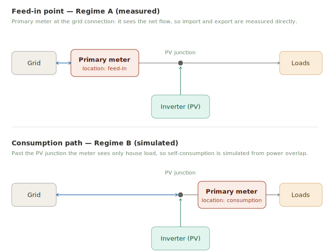

[](https://github.com/ahpohl/fronius-bridge/actions/workflows/build.yml)

# fronius-bridge

fronius-bridge is a lightweight service that reads operational data from one or more Fronius inverters and smart meters and publishes it to MQTT as JSON. It supports both Modbus TCP (IPv4/IPv6) and Modbus RTU (serial) connections, and serialises wire access for any devices that share a physical RS-485 bus.

## Features

- Multiple inverters and meters per process, each identified by a configurable `name`
- Reads inverter values such as power and energy
- Reads smart meter values (Fronius TS 65A-3 and SunSpec-compatible meters, and the EBZ [Easymeter](https://github.com/ahpohl/smartmeter-gateway/wiki/IR-dongle-pcb) over a serial USB-IR head)
- Supports Modbus over TCP (IPv4/IPv6) and serial RTU
- Shared-bus support: any number of devices may share a single RS-485 dongle, with wire access serialised through a per-bus transaction queue
- Manages night-time disconnections when the inverter enters standby and resumes publishing automatically
- Publishes values, events, device info and connection availability as JSON to an MQTT broker
- Optional PostgreSQL/TimescaleDB persistence, with one schema per device, nightly per-day energy rollups, and a whole-site daily rollup (see [Site energy](#site-energy) and [DEPLOYMENT.md](DEPLOYMENT.md))
- Fully configurable through a YAML configuration file
- Extensive, module-scoped logging with device-name-aware levels
- Automatic detection of register model, number of phases, MPPT tracker inputs, and hybrid/storage capability

## Common topology

The diagram below shows the simplest setup: one inverter on TCP, one meter on RS-485 served back to the inverter as a SunSpec endpoint. A real `inverters:` / `meters:` configuration can contain any number of devices, including several on a shared RS-485 dongle.


Both `inverters:` and `meters:` are optional sequences; at least one device across the two must be configured. See [Supported topologies](#supported-topologies) for the other variants.

## Status and limitations

- Battery/storage data is detected but not yet supported.

## Dependencies

- [libfronius](https://github.com/ahpohl/libfronius) — Modbus communication with inverter and meter
- [libmosquitto](https://mosquitto.org/) — MQTT client library
- [yaml-cpp](https://github.com/jbeder/yaml-cpp) — YAML configuration parsing
- [spdlog](https://github.com/gabime/spdlog) — Structured logging
- [libpq](https://www.postgresql.org/docs/current/libpq.html) — PostgreSQL client

The optional PostgreSQL consumer additionally requires a PostgreSQL server with the
**TimescaleDB** extension in the bridge's database; the nightly energy rollup also
uses **pg_cron**, which may live in a separate database on the cluster. See
[DEPLOYMENT.md](DEPLOYMENT.md).

## Configuration

fronius-bridge is configured via a YAML file passed with `-c <path>` (or the `FRONIUS_CONFIG` environment variable). The `inverters:` and `meters:` keys are sequences (YAML lists); each may be empty or omitted, but at least one device across the two must be configured.

### Example config

```yaml
# ================================
# fronius-bridge — configuration
# ================================
#
# Example devices:
# ----------------
# 1. Fronius Primo 4.0 inverter
# 2. Primary grid EBZ Easymeter
# 3. Secondary Fronius TS 65A-3 meter only for heat pump

site:
  # New York city timesquare
  latitude: 40.7589
  longitude: -73.9851
  horizon: -0.833

inverters:
  - name: primo
    rtu:
      device: /dev/ttyUSB0
    unit_id: 1
    response_timeout: { sec: 5, usec: 0 }
    update_interval: 4
    reconnect_delay: { min: 5, max: 320, exponential: true }

meters:
  - name: heatpump
    location: consumption
    rtu:
      device: /dev/ttyUSB0
      baud: 9600
      data_bits: 8
      stop_bits: 1
      parity: none
    unit_id: 2
    response_timeout: { sec: 5, usec: 0 }
    update_interval: 2
    reconnect_delay: { min: 5, max: 320, exponential: true }
    slave:
      tcp:
        listen: 0.0.0.0
        port: 503
      unit_id: 1
      use_float_model: false

  - name: grid
    type: ebz
    location: consumption
    primary: true
    rtu:
      device: /dev/ttyUSB1
      baud: 9600
      data_bits: 7
      stop_bits: 1
      parity: even
    grid:
      power_factor: 0.98
      leading: false    # false = inductive (lagging), true = capacitive (leading)
      frequency: 50.00
    slave:
      tcp:
        listen: 0.0.0.0
        port: 502
      unit_id: 1
      use_float_model: false

mqtt:
  broker: localhost
  port: 1883
  topic: fronius-bridge
  #user: mqtt
  #password: "your-secure-password"
  queue_size: 100
  reconnect_delay: { min: 2, max: 64, exponential: true }
  #tls:
  #  ca_file: /etc/ssl/certs/mqtt-ca.crt
  #  cert_file: /etc/ssl/certs/mqtt-client.crt
  #  key_file: /etc/ssl/private/mqtt-client.key

postgres:
  dsn: "host=localhost port=5432 dbname=fronius user=fronius_bridge password=your-secure-password"
  queue_size: 10000
  reconnect_delay: { min: 2, max: 64, exponential: true }

logger:
  level: info
  modules:
    main: info
    bus: info
    mqtt: info
    postgres: info
    inverter: info
    meter:
      master: info
      slave: info
```

### Configuration reference

**Per-device fields** (each entry in `inverters:` and `meters:`):

- name: Device identifier used in MQTT topics (`<topic>/inverter/<name>/...` or `<topic>/meter/<name>/...`). Mandatory. Must be unique across all inverters and meters combined. Constrained to `[A-Za-z0-9_-]+` and at most 32 characters. The literals `meter` and `inverter` are reserved (they would produce a visually ambiguous topic such as `<topic>/meter/meter/values`).
- tcp / rtu: Configure exactly one transport per device.
  - tcp.host: Hostname or IP (IPv4/IPv6) of the remote device.
  - tcp.port: Modbus TCP port (default: 502).
  - rtu.device: Serial device path (e.g. `/dev/ttyUSB0`). Devices that share the same path share an underlying transaction queue; see [Supported topologies](#supported-topologies).
  - rtu.baud: Baud rate (e.g. 9600, 19200, 38400).
  - rtu.data_bits / rtu.stop_bits: Data bits (5–8) and stop bits (1–2).
  - rtu.parity: `none`, `even`, or `odd`.
- unit_id: Modbus unit/slave ID of the remote device (1–247).
- response_timeout.sec / .usec: Response timeout — total = sec + usec. Increase on slow links.
- update_interval: Polling interval in seconds.
- reconnect_delay.min / .max / .exponential: Reconnect backoff. `exponential: true` ramps from min to max; `false` uses a fixed delay equal to min.

**inverters** *(optional sequence)*: Each entry is one Fronius inverter, identified by `name`. Per-device fields apply.

**meters** *(optional sequence)*: Each entry is one smart meter, identified by `name`. A meter's `type` selects how it is read (default `fronius`):

- **`type: fronius`** *(default)* — a SunSpec/Fronius meter reached over Modbus (TCP or RTU). All per-device fields above apply. Two register models are auto-detected on connect — no manual selection needed:
  - *Fronius TS 65A-3 proprietary* — direct RTU connection to a TS 65A-3 smart meter.
  - *SunSpec* — all other cases: meter proxied via an inverter's TCP interface (use `unit_id: 240` for the primary meter, 241 for secondary), or any standalone SunSpec-compatible meter.
- **`type: ebz`** — an EBZ Easymeter read passively over a USB-IR head on a dedicated serial line (SML/OBIS telegrams), not Modbus. It accepts only `rtu` and an optional `grid` block; the Modbus-only keys (`tcp`, `unit_id`, `update_interval`, `response_timeout`, `reconnect_delay`) are rejected at config-load. It owns its serial line exclusively — the path may not be shared with any master or slave — and publishes as telegrams arrive rather than on a poll interval. At most one `type: ebz` meter may be configured, since an installation has a single grid meter. For building the USB-IR read head and the meter hardware itself, see the [smartmeter-gateway](https://github.com/ahpohl/smartmeter-gateway) project and its wiki. The EBZ reports only active power and energy; reactive and apparent quantities and per-phase currents are derived from the `grid` assumptions:
  - grid.power_factor: assumed power factor, range (0.0, 1.0] (default 0.95).
  - grid.frequency: assumed grid frequency in Hz (default 50.0).
  - grid.leading: `true` if the assumed reactive power is leading, else lagging (default false).

A meter of either type may also declare its role in the whole-site energy rollup (see [Site energy](#site-energy)):
- location: `feed-in` or `consumption` — where the primary meter sits in the wiring, which selects how the daily rollup derives self-consumption (see [Grid meter placement](#grid-meter-placement)). Optional; a meter without `location` is still recorded but takes no special role in the rollup.
- primary: `true` marks the one meter whose `location` defines the site's grid reference and therefore selects the rollup regime. At most one meter may be `primary`, and `primary` requires `location`; both are enforced at config-load. Secondary consumption meters (e.g. a heat pump) are informational sub-loads and are not summed into site consumption.

Each meter entry (of either type) may additionally carry a nested `slave:` block which exposes a SunSpec-compliant Modbus server so the inverter or another master can read this meter's values from fronius-bridge. Either TCP or RTU may be used; for the standard Fronius use case, configure TCP. The slave's RTU device path (if used) may not match any master's RTU device, and no two slaves may share an RTU device — both checks are enforced at config-load.

Slave fields:
- tcp.listen: Bind address for the listener. Use `0.0.0.0` for all IPv4 interfaces (default).
- tcp.port: Local listening port. Distinct slaves must bind distinct (listen, port) pairs.
- unit_id: Modbus unit/slave ID to advertise to clients.
- request_timeout: Seconds to wait for a request before considering the session stalled.
- idle_timeout: Seconds of inactivity after which the client is treated as gone. In TCP mode the idle client is disconnected; in RTU mode the listener keeps running and simply marks the client inactive in the log.
- use_float_model: `false` (default) exposes int+sf registers (Fronius-compatible); `true` exposes 32-bit IEEE 754 float registers.

**site** *(optional)*: The installation's coordinates, used to compute the local daylight window for the inverter's daily-rollup quality flags. Recommended whenever the PostgreSQL rollup is enabled — without coordinates the inverter's `coverage` and `continuity` fall back to the full 24h day, which a daylight-only inverter can never satisfy, so its days never flag `complete` / `continuous` (see [Site energy](#site-energy)).
- latitude: Decimal degrees, range [-90, 90] (north positive). Drives the length of the daylight window.
- longitude: Decimal degrees, range [-180, 180] (east positive). Needed alongside `latitude` for the daylight calculation; it sets the solar clock, while the window length is latitude-driven.
- horizon: Sun-centre altitude in degrees counted as sunrise/sunset, range [-18, 20] (default -0.833, standard refraction plus solar radius). If a clear day's inverter coverage lands just over 1.0, lower this to match what the SunSpec interface reports.

**mqtt**: Connection to the MQTT broker.
- broker / port: Broker hostname and port. 1883 is the plaintext default; for TLS use 8883 (the conventional secure MQTT port) and add a `tls` block.
- topic: Base topic — subtopics (`/<class>/<name>/values`, etc.) are appended automatically. See [MQTT publishing](#mqtt-publishing).
- user / password: Optional broker authentication.
- queue_size: Per-topic publish queue depth. Messages beyond this limit are dropped.
- reconnect_delay: Same semantics as the per-device `reconnect_delay`.
- tls *(optional)*: Secures the broker connection with TLS. Present means TLS, absent means plaintext. An empty block (`tls: {}`) verifies the broker against the OS trust store, which is enough for a broker using a public CA (e.g. Let's Encrypt). Keys:
  - ca_file / ca_path: PEM CA file, or a directory of PEM CA certificates, that signed the broker certificate. Use these for a private CA.
  - cert_file / key_file: Client certificate and private key for mutual TLS. Both must be set together, and a `ca_file` or `ca_path` is required alongside them.
  - tls_version: TLS protocol version (e.g. `tlsv1.2`, `tlsv1.3`). Defaults to the libmosquitto/OpenSSL default when omitted.
  - ciphers: OpenSSL cipher list. See `openssl ciphers` for a list of supported ciphers. Defaults to the library default when omitted.
  - insecure: Disables broker certificate and hostname verification. Accepts a self-signed certificate but provides no security — for testing only, default `false`.

**postgres** *(optional)*: Enables the PostgreSQL/TimescaleDB consumer. Omit the whole section to run MQTT-only. Each device is written into its own schema named after the device (`name`); full database setup, rollups, and query patterns are described in [DEPLOYMENT.md](DEPLOYMENT.md).
- dsn: libpq connection string (e.g. `host=localhost port=5432 dbname=fronius user=fronius_bridge password=...`). Mandatory when the section is present.
- queue_size: In-memory worker queue depth. When full, the oldest events are dropped (newer telemetry wins). Default 10000.
- reconnect_delay: Same semantics as the per-device `reconnect_delay`; governs the worker's connect/reconnect backoff.

On startup the worker verifies the `timescaledb` extension is installed in its database and, by default, creates or upgrades each device's schema on first sight. The `--no-migrate` command-line flag switches this to verify-only (the schemas must already exist); it has no effect without a `postgres` section. The nightly energy rollup additionally uses `pg_cron`, which is set up separately (and may live in another database); see [DEPLOYMENT.md](DEPLOYMENT.md).

**logger**:
- level: Global default — `off`, `error`, `warn`, `info`, `debug`, `trace`.
- modules: Per-module overrides using the same level values. Loggers are fixed class-based modules, independent of device names: `meter` and `inverter` for the two device classes, plus the built-in `main`, `mqtt`, and `bus`. The `meter` module covers both meter roles; override one independently with `meter.master:` or `meter.slave:`. Per-device targeting is not available — the device name already appears in each connect/disconnect message.
- the flat `key.subkey: value` form and the nested `key: { subkey: value }` form are equivalent — pick whichever reads better.

## Supported topologies

**Inverter(s) only** — leave `meters:` empty or omitted. Configure one or more entries under `inverters:`. Each is reached over TCP or RTU.

**Meter(s) only** — leave `inverters:` empty or omitted. Useful for standalone meter monitoring.

**Meter behind inverter (TCP proxy)** — configure a meter entry with TCP pointing at the inverter's IP and `unit_id: 240` (primary meter per the Fronius Datamanager specification; secondary starts at 241). The inverter proxies register requests to the meter on its internal RS-485 port over SunSpec. No USB dongle required, and no `slave:` block is needed since the inverter already has direct meter access.

**Meter slave without inverter** — a meter entry with a `slave:` block can operate without any inverter configured. fronius-bridge reads the meter directly and serves the values over TCP (or RTU) to any Modbus master that connects.

**EBZ Easymeter (serial, non-Modbus)** — a meter entry with `type: ebz` reads an EBZ Easymeter over a USB-IR head on a dedicated serial line. It does not join the shared RTU bus and is not polled; it publishes as SML/OBIS telegrams arrive. At most one EBZ meter may be configured, and its serial line must be exclusive (not shared with any Modbus master or slave); both are enforced at config-load. Like any meter it may carry a `slave:` block to re-serve its values as a SunSpec endpoint.

**Shared RTU bus** — any number of inverter and meter entries may share the same physical serial dongle by setting their `rtu.device` to the same path (e.g. `/dev/ttyUSB0`). fronius-bridge serialises all wire access on a shared device through a single transaction queue, so devices are polled in turn rather than concurrently. When sharing, all RTU line parameters (`baud`, `data_bits`, `stop_bits`, `parity`) must match across the sharing devices and the `unit_id` values must be distinct; both checks are enforced at config-load. Per-device `reconnect_delay` settings on a shared bus are aggregated to a single bus-level policy by taking the minimum `min`, the minimum `max`, and OR-ing the `exponential` flags.

**Multiple devices of either kind** — `inverters:` and `meters:` are sequences, so any combination of devices is supported. Each entry carries its own `name`, transport, and (for meters) optional `slave:` block. MQTT topics route per-device through the `<class>/<name>` segments — see [MQTT publishing](#mqtt-publishing).

## Grid meter placement

The whole-site rollup needs to know where the **primary** meter sits in the wiring, because that fixes what it can physically measure — and therefore how each day's production and consumption split into self-consumption (PV used on site) and grid import/export. fronius-bridge supports the two placements Fronius documents for its Smart Meter, selected by the primary meter's `location`:



In both placements the production and consumption *totals* come from gap-immune counter rollups — each inverter's `produced_kwh` and the consumption meter's import counter `imported_kwh`. Reading a cumulative counter near both day edges captures everything in between, so the totals are exact and agree across regimes. The placements differ only in how those totals divide into self-consumption and grid exchange.

### Feed-in point: `location: feed-in` (Regime A, measured)

The primary meter is a bidirectional meter at the grid connection point, ahead of the PV junction, so it measures net import and export directly. The split is then exact arithmetic — nothing is estimated:

```
production       = sum of every inverter's produced_kwh
from_grid        = primary meter's imported counter
to_grid          = primary meter's exported counter
self_consumption = max(production - to_grid, 0)
consumption      = self_consumption + from_grid
```

### Consumption path: `location: consumption` (Regime B, simulated)

This is a 100% feed-in installation: all generation is exported and the house draws entirely from the grid, so the primary meter — wired in the consumption branch, past the PV junction — sees only house load. Self-consumption is never directly measured, so it alone is estimated, from the time-aligned overlap of PV production power and house consumption power over 30-second buckets (Pb = summed inverter power, Cb = primary consumption-meter power, both ≥ 0):

```
self_consumption = sum of min(Pb, Cb)        -- then clamped to <= production and consumption
to_grid          = production  - self_consumption
from_grid        = consumption - self_consumption
```

Production and consumption stay the counter totals above; only the split is estimated, and the grid legs follow by subtraction, so both energy balances stay exact and non-negative. Because the overlap uses bucket *averages* the estimate is slightly optimistic, but the 30-second resolution keeps that bias small. A mid-day data gap biases it low instead — which the `continuous` flag catches (see [Site energy](#site-energy)).

## Site energy

When the PostgreSQL consumer is enabled and a meter is marked `primary`, fronius-bridge maintains a whole-site daily rollup in `public.site_energy` — one row per day with production, consumption, self-consumption, and grid import/export, all in kWh. The table stores energy quantities only; ratios such as self-sufficiency (self-consumption / consumption) and self-usage (self-consumption / production) follow trivially from those columns and are left to the dashboard. The rollup is computed by `public.compute_site_energy()` and scheduled alongside the per-device rollups; setup, a function reference, and queries are in [DEPLOYMENT.md](DEPLOYMENT.md#daily-rollups-with-pg_cron).

Devices announce their role through a small `public.device_registry` table that the bridge keeps in sync with the configuration on every startup (one row per device: its kind, and for meters their `location` and `primary` flag). The rollup reads the registry, so it needs no hardcoded device names and adapts as devices are added or removed. How each day's totals split into self-consumption and grid exchange is set by where the primary meter sits — see [Grid meter placement](#grid-meter-placement).

Each day carries two quality flags — `complete` and `continuous` — so questionable rows can be filtered or annotated (e.g. dimmed in Grafana) rather than silently trusted. They mirror the flags the per-device `daily` rows carry and are aggregated the same way: the site's `complete` is true only when every contributing device-day was itself complete (its samples spanned the day — `coverage`), and the site's `continuous` is true only when every one was itself continuous (its 30-second buckets densely cover the expected window — `continuity ≥ 0.90`). The two are independent and stored separately. Because `complete` is span-based it cannot see a mid-day outage, so a consumer trusts the measured regime on `complete` alone — its counter arithmetic is gap-immune, making `continuous` merely informational there — and the simulated regime on `complete AND continuous`, since its self-consumption split is summed from those buckets. A Regime B day with a mid-day gap therefore reads `complete` true but `continuous` false.

## MQTT publishing

Messages are published as JSON under the configured base topic. QoS 1, retained. Consecutive duplicate payloads per topic are suppressed.

Each topic carries both a device class segment (`inverter` or `meter`) and the device's `name`, giving consumers two natural wildcards: `<topic>/inverter/+/values` matches every inverter's telemetry, and `<topic>/+/<name>/values` matches every value publish for a specifically-named device regardless of class.

| Component | Subtopic                                  | Content                         |
|-----------|-------------------------------------------|---------------------------------|
| Inverter  | `<topic>/inverter/<name>/values`          | Telemetry (power, energy, etc.) |
| Inverter  | `<topic>/inverter/<name>/events`          | Faults and alarms               |
| Inverter  | `<topic>/inverter/<name>/device`          | Static device metadata          |
| Inverter  | `<topic>/inverter/<name>/availability`    | `connected` or `disconnected`   |
| Meter     | `<topic>/meter/<name>/values`             | Telemetry (power, energy, etc.) |
| Meter     | `<topic>/meter/<name>/device`             | Static device metadata          |
| Meter     | `<topic>/meter/<name>/availability`       | `connected` or `disconnected`   |

For example, with `mqtt.topic: fronius-bridge` and a meter named `heatpump`, the telemetry topic is `fronius-bridge/meter/heatpump/values`.

### Example payloads

- Topic: `<topic>/inverter/<name>/values`
  ```jsonc
  {
    "time": 1762607887640,
    "ac_energy": 11060.2,
    "ac_power_active": 238.0,
    "ac_power_apparent": 238.1,
    "ac_power_reactive": 5.0,
    "ac_power_factor": -100.0,
    "phases": [{ "id": 1, "ac_voltage": 235.9, "ac_current": 1.0 }],
    "ac_frequency": 50.0,
    "dc_power": 285.2,
    "efficiency": 83.4,
    "inputs": [
      { "id": 1, "dc_voltage": 294.2, "dc_current": 0.45, "dc_power": 132.4, "dc_energy": 5468.4 },
      { "id": 2, "dc_voltage": 293.9, "dc_current": 0.52, "dc_power": 152.8, "dc_energy": 0.1 }
    ]
  }
  ```

- Topic: `<topic>/inverter/<name>/events`
  ```json
  { "active_code": 0, "state": "Tracking power point", "events": [] }
  ```

- Topic: `<topic>/inverter/<name>/device`
  ```jsonc
  {
    "manufacturer": "Fronius", "model": "Primo 4.0-1", "serial_number": "34119102",
    "firmware_version": "0.3.30.2", "data_manager": "3.32.1-2",
    "register_model": "int+sf", "hybrid": false,
    "inverter_id": 101, "slave_id": 1, "phases": 1, "mppt_tracker": 2, "power_rating": 4000.0
  }
  ```

- Topic: `<topic>/meter/<name>/values`
  ```jsonc
  {
    "time": 1762607887640,
    "energy_active_import": 3521.847,   "energy_active_export": 8042.113,
    "energy_apparent_import": 3980.201, "energy_apparent_export": 8510.774,
    "energy_reactive_import": 120.034,  "energy_reactive_export": 410.882,
    "power_active": -1842.0, "power_apparent": 1843.0, "power_reactive": 45.0,
    "power_factor": -99.9, "frequency": 50.0,
    "voltage_ph": 234.2, "voltage_pp": 0.0, "current": 7.864,
    "phases": [
      {
        "id": 1, "power_active": -1842.0, "power_apparent": 1843.0,
        "power_reactive": 45.0, "power_factor": -99.9,
        "voltage_ph": 234.2, "voltage_pp": 0.0, "current": 7.864
      }
    ]
  }
  ```

- Topic: `<topic>/meter/<name>/device`
  ```jsonc
  {
    "manufacturer": "Fronius", "model": "TS 65A-3", "serial_number": "12345678",
    "firmware_version": "1.3.0", "data_manager": "",
    "register_model": "proprietary", "slave_id": 1, "meter_id": 203, "phases": 1
  }
  ```

### Inverter field reference

| Field               | Description                      | Units | Notes |
|---------------------|----------------------------------|-------|-------|
| time                | Timestamp (Unix epoch)           | ms    | UTC |
| ac_energy           | Cumulative AC energy             | Wh    | |
| ac_power_active     | Active AC power                  | W     | |
| ac_power_apparent   | Apparent AC power                | VA    | |
| ac_power_reactive   | Reactive AC power                | var   | |
| ac_power_factor     | Power factor                     | %     | Range -100..100 |
| ac_frequency        | AC frequency                     | Hz    | |
| phases[].id         | Phase index                      | —     | Starts at 1 |
| phases[].ac_voltage | Per-phase AC voltage             | V     | |
| phases[].ac_current | Per-phase AC current             | A     | |
| dc_power            | Total DC input power             | W     | Sum of inputs |
| efficiency          | Conversion efficiency            | %     | ac_power_active / dc_power × 100 |
| inputs[].id         | DC input index                   | —     | Starts at 1 |
| inputs[].dc_voltage | DC input voltage                 | V     | |
| inputs[].dc_current | DC input current                 | A     | |
| inputs[].dc_power   | DC input power                   | W     | |
| inputs[].dc_energy  | Cumulative DC energy per input   | Wh    | Omitted on hybrid models |
| active_code         | Inverter state code              | —     | |
| state               | Inverter state string            | —     | |
| events              | Array of event strings           | —     | May be empty |
| manufacturer        | Manufacturer                     | —     | |
| model               | Model name                       | —     | |
| serial_number       | Serial number                    | —     | |
| firmware_version    | Firmware version                 | —     | |
| data_manager        | Data manager version             | —     | |
| register_model      | Register model in use            | —     | `float` or `int+sf` |
| hybrid              | Hybrid/storage capable           | —     | Battery not yet supported |
| mppt_tracker        | Number of MPPT inputs            | —     | |
| phases              | Number of AC phases              | —     | |
| power_rating        | Apparent power rating            | VA    | |
| inverter_id         | Inverter numeric ID              | —     | |
| slave_id            | Modbus address                   | —     | |

### Meter field reference

| Field                    | Description                           | Units  | Notes |
|--------------------------|---------------------------------------|--------|-------|
| time                     | Timestamp (Unix epoch)                | ms     | UTC |
| energy_active_import     | Cumulative active energy from grid    | kWh    | |
| energy_active_export     | Cumulative active energy to grid      | kWh    | |
| energy_apparent_import   | Cumulative apparent energy imported   | kVAh   | |
| energy_apparent_export   | Cumulative apparent energy exported   | kVAh   | |
| energy_reactive_import   | Cumulative reactive energy imported   | kvarh  | |
| energy_reactive_export   | Cumulative reactive energy exported   | kvarh  | |
| power_active             | Total active power                    | W      | Negative = export |
| power_apparent           | Total apparent power                  | VA     | |
| power_reactive           | Total reactive power                  | var    | |
| power_factor             | Total power factor                    | %      | Range -100..100 |
| frequency                | AC frequency                          | Hz     | |
| voltage_ph               | Phase-to-neutral voltage              | V      | |
| voltage_pp               | Phase-to-phase voltage                | V      | 0.0 on single-phase |
| current                  | Total current                         | A      | |
| phases[].id              | Phase index                           | —      | Starts at 1 |
| phases[].power_active    | Per-phase active power                | W      | Negative = export |
| phases[].power_apparent  | Per-phase apparent power              | VA     | |
| phases[].power_reactive  | Per-phase reactive power              | var    | |
| phases[].power_factor    | Per-phase power factor                | %      | |
| phases[].voltage_ph      | Per-phase phase-to-neutral voltage    | V      | |
| phases[].voltage_pp      | Per-phase phase-to-phase voltage      | V      | |
| phases[].current         | Per-phase current                     | A      | |
| manufacturer             | Manufacturer                          | —      | |
| model                    | Model name                            | —      | |
| serial_number            | Serial number                         | —      | |
| firmware_version         | Firmware version                      | —      | |
| data_manager             | Data manager version                  | —      | Empty if not applicable |
| register_model           | Register model detected on connect    | —      | `proprietary` or `sunspec` |
| meter_id                 | Meter numeric ID                      | —      | |
| slave_id                 | Modbus address                        | —      | |
| phases                   | Number of AC phases                   | —      | |

### Conventions

Energy counters (`energy_*`) are cumulative values maintained by the physical meter, published in kWh/kVAh/kvarh. The application does not reset them on restart.

`power_active` uses the load convention: positive = import from grid, negative = export to grid. `power_factor` and `ac_power_factor` are percentages in the range -100..100.

## Troubleshooting

- **Connection timeouts** — increase `response_timeout` or `update_interval`. Verify `unit_id` and transport match the device.
- **Meter register model not detected** — set the meter logger to `debug` (`meter: debug`, or `meter.master: debug`); the detected model is logged on connect.
- **Meter slave not responding to inverter** — verify the meter's `slave.unit_id` matches what the inverter queries, and that `use_float_model: false` (Fronius inverters require int+sf).
- **Shared bus diagnostics** — set `bus: debug` in `logger.modules` to see per-transaction tx/rx activity, queue depth, and slave-switch events; `bus: trace` adds the low-level libmodbus telegrams.
- **Frequent MQTT reconnects** — check broker reachability, credentials, and `mqtt.reconnect_delay`.

## Security

- Prefer running MQTT behind a trusted network or VPN. If using authentication, set `mqtt.user`/`mqtt.password` and restrict the config file with `chmod 0600`. To encrypt the broker connection, enable `mqtt.tls` (see the `tls` keys above); credentials sent in plaintext are otherwise visible on the wire.
- Binding a meter's `slave.tcp.port` to a port below 1024 requires elevated privileges or `CAP_NET_BIND_SERVICE`. Use `--user`/`--group` to drop privileges after startup once the listener is bound.

## License

[MIT](LICENSE)

---

*fronius-bridge* is not affiliated with or endorsed by Fronius International GmbH.
